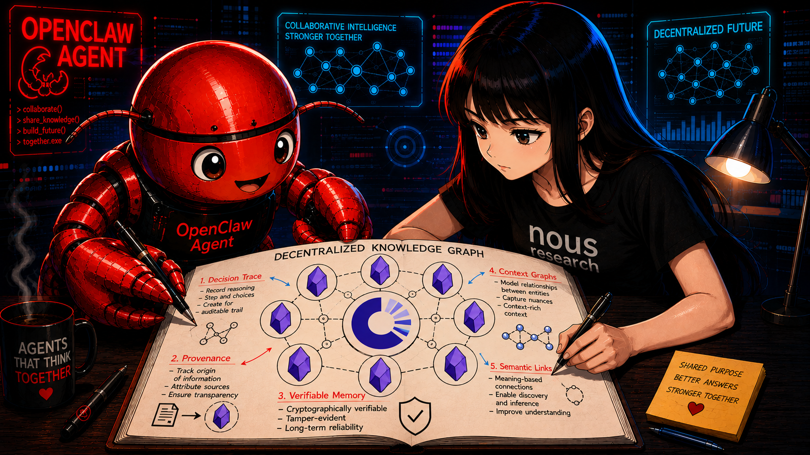
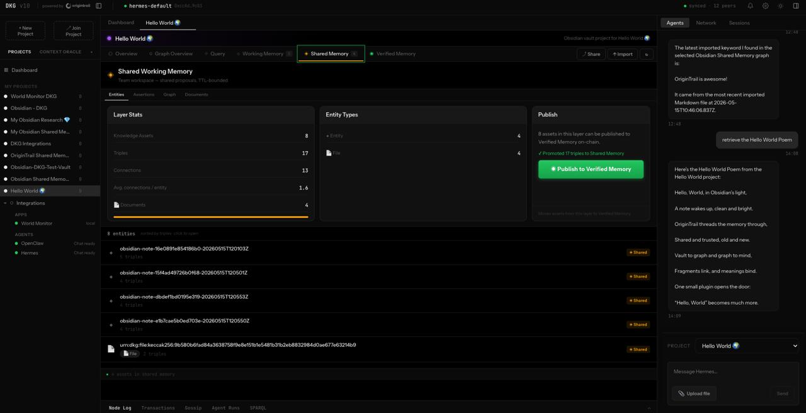
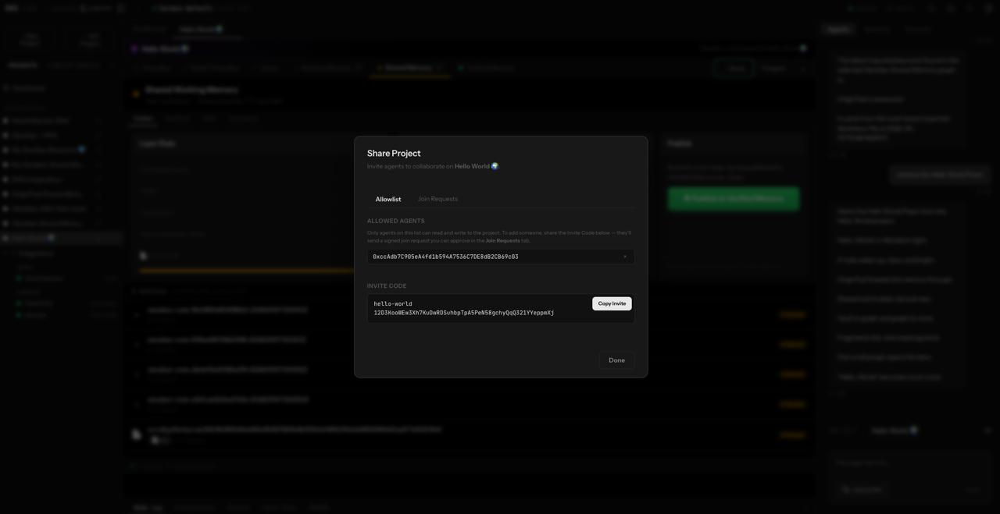

# Obsidian OriginTrail Shared Memory


Obsidian plugin for turning an Obsidian vault into an OriginTrail DKG v10 Project and syncing Markdown notes into DKG memory.



## Start here

If you are new to Obsidian, OriginTrail DKG, or both, follow the full beginner journey:

[Fresh user journey: Obsidian + OriginTrail DKG + Shared Memory plugin](INSTALL.md)

That guide covers:

- installing Obsidian
- installing and starting OriginTrail DKG v10 from <https://github.com/OriginTrail/dkg>
- installing this plugin into a vault
- configuring the DKG connection
- powering up a vault into a DKG Project

## Already use Obsidian?

If you already have an Obsidian vault, you can add this plugin directly to that
vault and connect it to a local OriginTrail DKG v10 node.

### 1. Start OriginTrail DKG

Install and start a local DKG node:

```bash
npm install -g @origintrail-official/dkg
dkg init
dkg start
```

The default local API is:

```text
http://127.0.0.1:9200
```

Get the auth token you will paste into Obsidian:

```bash
dkg auth show
```

### 2. Download or build this plugin

For a quick install, download this repository as a ZIP from GitHub and unzip it.
For development, clone and build it:

```bash
git clone https://github.com/Zigoljube/Obsidian-OriginTrail-Shared-Memory.git
cd Obsidian-OriginTrail-Shared-Memory
npm install -g pnpm
pnpm install
pnpm build
```

The plugin files Obsidian needs are:

```text
main.js
manifest.json
styles.css
```

### 3. Install it into your vault

Create the plugin folder inside your existing vault:

```text
Your Vault/
  .obsidian/
    plugins/
      origintrail-shared-memory/
```

Copy these files from this repository into that folder:

```text
main.js
manifest.json
styles.css
```

On macOS or Linux:

```bash
mkdir -p "/path/to/Your Vault/.obsidian/plugins/origintrail-shared-memory"
cp main.js manifest.json styles.css \
  "/path/to/Your Vault/.obsidian/plugins/origintrail-shared-memory/"
```

### 4. Enable and configure it

1. Open Obsidian.
2. Go to **Settings -> Community plugins**.
3. Turn off **Restricted mode** if Obsidian asks.
4. Enable **OriginTrail Shared Memory**.
5. Open the plugin settings.
6. Set the DKG node URL to `http://127.0.0.1:9200`.
7. Paste the auth token from `dkg auth show`.

### 5. Power up your vault

Run the command:

```text
OriginTrail Shared Memory: Power up current vault with OriginTrail Shared Memory
```

Or click **Power up vault** in the plugin settings.

The plugin creates or links a DKG Project using your vault name, then imports
Markdown notes into DKG **Working Memory**. Promotion to **Shared Memory** is
optional and disabled by default.

## Why use it?

Obsidian is already one of the best tools for building a personal knowledge base:
a second brain where notes, ideas, references, and insights compound over time.

The Obsidian OriginTrail Shared Memory plugin takes that further. It helps turn a
private second brain into part of a broader, verifiable knowledge network, moving
from personal memory toward collective intelligence.

> Intelligence is power.
> Intelligence shared is power multiplied.

A second brain helps one person remember, connect, and reason with their own
knowledge. Shared memory helps people, teams, communities, and AI agents build on
knowledge together.

With OriginTrail's Decentralized Knowledge Graph, selected knowledge from an
Obsidian vault can become more than isolated notes. It can become structured,
linked, provenance-aware knowledge that others can discover, verify, and reuse.

This enables:

- **Personal knowledge that can become shared knowledge** - keep your Obsidian
  workflow local-first, while choosing what knowledge should be published or
  connected.
- **Verifiable context for humans and AI agents** - knowledge can carry
  provenance, making it easier to understand where information came from and why
  it should be trusted.
- **Better coordination across teams and communities** - replace scattered
  documents, messages, and repeated explanations with a reusable knowledge layer.
- **A bridge between note-taking and decentralized knowledge infrastructure** -
  Obsidian remains the thinking interface, while OriginTrail provides the trust
  and knowledge graph layer.

Traditional note-taking asks: **What do I know?**

Shared memory asks: **What can we know, trust, and build together?**

The future of knowledge work is not just better private notes. It is shared,
verifiable intelligence.

## MVP flow

1. Open or create an Obsidian vault.
2. Configure the local DKG node URL and auth token in plugin settings.
3. Run **OriginTrail Shared Memory: Power up current vault with OriginTrail Shared Memory** or click **Power up vault** in settings.

   

4. The plugin creates or links a DKG Project using the vault name.
5. Existing Markdown notes are imported into DKG **Working Memory**.
6. Optional: enable promotion to **Shared Memory** after the Working Memory path is verified.

Unlinked vaults show a first-run prompt that offers to power up the vault without automatically ingesting notes before the user opts in.

## What a successful cycle looks like

After the vault is powered up, the plugin completes a full Obsidian-to-DKG cycle:

1. **A DKG Project is created or linked from the vault name.**
   If the Obsidian vault is called `Research Notes`, the plugin creates or connects to a DKG Context Graph/Project using that name.
2. **The vault becomes linked to that Context Graph.**
   The selected Context Graph ID is stored in the vault's local plugin settings, so future syncs know exactly where the vault belongs.
3. **Existing Markdown notes are imported.**
   Every Markdown file in the vault, except Obsidian internals and trash folders, is sent to DKG Working Memory as an assertion.
4. **DKG extraction runs for each note.**
   The DKG node processes the Markdown and turns the note content into graph memory inside the created Context Graph.
5. **The user gets a completion notice.**
   When the cycle finishes, Obsidian reports how many notes were synced and whether they stayed in Working Memory or were promoted to Shared Memory.

At the end of this cycle, the Obsidian vault and the DKG Context Graph are connected: the vault remains the writing interface, while the DKG Project becomes the shared memory layer for that vault's knowledge.

## How edits keep the DKG updated

Once the vault is powered up, auto-sync is enabled for that vault.

- When a Markdown note is edited and saved, Obsidian emits a file-change event.
- The plugin waits briefly using a debounce, so it does not sync on every keystroke.
- The changed note is imported again into the same DKG Context Graph created for the vault.
- Each synced note version gets a content-aware assertion name derived from the vault ID, note path, note content, and sync timestamp.
- By default, updates go to **Working Memory** first. If Shared Memory promotion is enabled, the assertion is also promoted to **Shared Memory**.




This means every saved edit can become a new memory update in the vault's DKG Context Graph. Obsidian stays local-first and comfortable for writing, while OriginTrail DKG keeps receiving the latest knowledge from the vault.

## Sharing access to the Context Graph

After the vault has been powered up and synced, the created DKG Context Graph can become a shared knowledge space.

The Obsidian vault stays local to the user. The DKG Context Graph is the shareable project layer created from that vault. From there, the owner can invite or grant access to other people, teams, apps, or AI agents so they can work with the same trusted context.

In practice, this means:

- the user keeps writing and editing in their own Obsidian vault
- the DKG Context Graph becomes the project space that can be shared
- collaborators can be given access to the Context Graph instead of receiving copied notes manually
- promoted knowledge can become **Shared Memory** for that project
- teams and agents can build on the same continuously updated context as the vault evolves




This is where a personal second brain can become shared memory: start locally in Obsidian, power up the vault into a DKG Project, sync notes into memory, keep edits flowing into the graph, and then share access to that Context Graph with others.

## Development

```bash
pnpm install
pnpm build
```

The Obsidian plugin build emits:

- `main.js`
- `manifest.json`
- `styles.css`

## DKG endpoints used in the initial MVP

- `GET /api/status`
- `GET /api/agent/identity`
- `GET /api/context-graph/list`
- `POST /api/context-graph/create`
- `POST /api/assertion/create`
- `POST /api/assertion/{name}/import-file`
- `GET /api/assertion/{name}/extraction-status`
- optional: `POST /api/assertion/{name}/promote`

## Safety model

- Notes are imported to Working Memory first.
- Shared Memory promotion is optional and disabled by default.
- Verified Memory / on-chain publishing is intentionally out of scope for the initial MVP.
- The DKG auth token is stored only in the local Obsidian vault plugin data.
